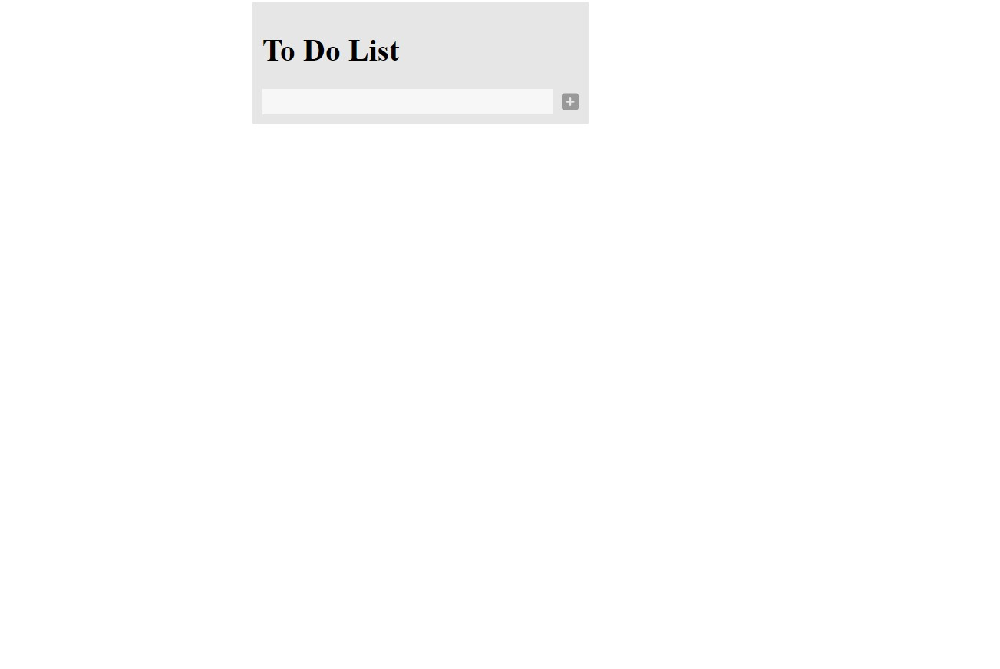
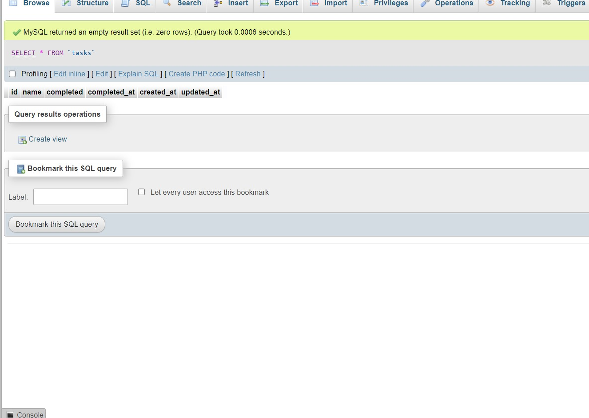

# ToDoListLaravelapp

Application is used for creating simple tasks and describe whether it is completed or not. It is just like reminder or notes.

# Stack Used

Laravel Vue Spa
Vue for Frontend
Laravel for Backend

# Please check photos of application and download the application for code review Some updates are remained but it will be done in free time.

Main Screen

Adding Task

Task Added in Database

Task Completed 

Task Completed in Database

Task Deleted 

Task Deleted in Database

